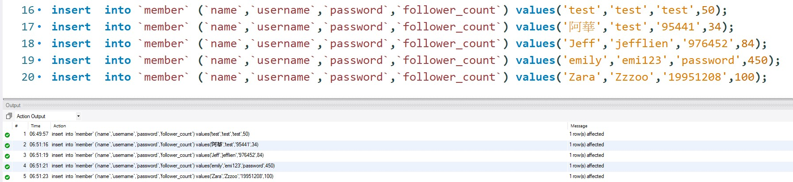

##要求三：SQL CRUD
>使用 INSERT 指令新增一筆資料到 member 資料表中，這筆資料的 username 和
password 欄位必須是 test。接著繼續新增至少 4 筆隨意的資料。

>使用 SELECT 指令取得所有在 member 資料表中的會員資料。

>使用 SELECT 指令取得所有在 member 資料表中的會員資料，並按照 time 欄位，由
近到遠排序。

>使用 SELECT 指令取得 member 資料表中第 2 ~ 4 共三筆資料，並按照 time 欄位，
由近到遠排序。( 並非編號 2、3、4 的資料，而是排序後的第 2 ~ 4 筆資料 )

>使用 SELECT 指令取得欄位 username 是 test 的會員資料。

>使用 SELECT 指令取得欄位 username 是 test、且欄位 password 也是 test 的資料。

> 使用 UPDATE 指令更新欄位 username 是 test 的會員資料，將資料中的 name 欄位改成 test2。

##要求四：SQL Aggregate Functions
>取得 member 資料表中，總共有幾筆資料 ( 幾位會員 )。

>取得 member 資料表中，所有會員 follower_count 欄位的總和。

>取得 member 資料表中，所有會員 follower_count 欄位的平均數。

##要求五：SQL JOIN (Optional)
>使用 SELECT 搭配 JOIN 語法，取得所有留言，結果須包含留言者會員的姓名。

>使用 SELECT 搭配 JOIN 語法，取得 member 資料表中欄位 username 是 test 的所有
留言，資料中須包含留言者會員的姓名。

